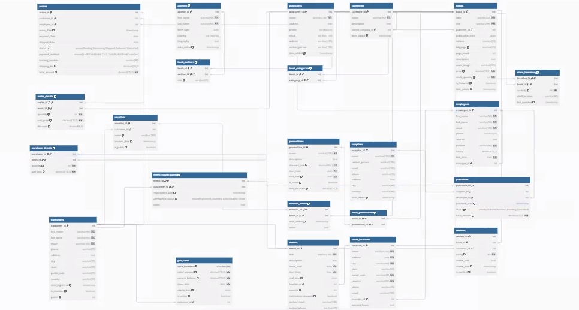

# database-wk-8

# Book Store Database Management System

## Overview
This database system is designed to manage all aspects of a modern bookstore operation, including inventory management, customer relations, sales tracking, supplier interactions, and store events. The system is built with MySQL and provides a comprehensive solution for both physical and potentially online bookstore operations.

## Database Structure
The database consists of 20 tables organized into several functional modules:

### Core Inventory Management
- **books**: Central table storing book information including ISBN, title, price, and stock quantity
- **authors**: Information about book authors
- **publishers**: Details about book publishing companies
- **categories**: Hierarchical book categories with optional parent-child relationships
- **book_authors**: Connects books with their authors (many-to-many)
- **book_categories**: Associates books with categories (many-to-many)

### Customer Management
- **customers**: Customer personal information and loyalty program data
- **wishlists**: Customer book wish lists
- **wishlist_books**: Books in customer wish lists (many-to-many)
- **reviews**: Customer book ratings and reviews

### Sales Processing
- **orders**: Customer order information including status and payment method
- **order_details**: Specific books in each order with quantity and pricing
- **gift_cards**: Gift card tracking with balance management

### Supplier Management
- **suppliers**: Information about book suppliers
- **purchases**: Orders made to suppliers
- **purchase_details**: Specific books in each supplier order

### Store Operations
- **employees**: Staff information including hierarchy
- **store_locations**: Physical store location details
- **store_inventory**: Book inventory at specific store locations
- **promotions**: Sales and promotional campaigns
- **book_promotions**: Books included in promotions (many-to-many)

### Event Management
- **events**: In-store events like book signings or readings
- **event_registrations**: Customer registrations for events

## Entity Relationship Diagram



## Table Relationships

### One-to-Many Relationships:
- Publishers → Books
- Customers → Orders
- Employees → Orders
- Suppliers → Purchases
- Employees → Purchases
- Customers → Wishlists
- Employees → Store Locations (as managers)
- Store Locations → Events

### Many-to-Many Relationships:
- Books ↔ Authors (via book_authors)
- Books ↔ Categories (via book_categories)
- Books ↔ Promotions (via book_promotions)
- Orders ↔ Books (via order_details)
- Purchases ↔ Books (via purchase_details)
- Wishlists ↔ Books (via wishlist_books)
- Events ↔ Customers (via event_registrations)
- Store Locations ↔ Books (via store_inventory)

### Self-Relationships:
- Categories → Categories (parent-child hierarchy)
- Employees → Employees (manager-subordinate)

## Key Features

### Inventory Management
- Complete book details tracking with ISBNs, titles, authors, pricing
- Multi-location inventory tracking
- Category management with hierarchical structure
- Stock level monitoring

### Customer Engagement
- Customer accounts with contact information
- Loyalty program with points
- Wishlist functionality
- Book review and rating system
- Event registration

### Sales Operations
- Complete order processing and tracking
- Multiple payment methods
- Order status updates
- Gift card management
- Promotional pricing and campaigns

### Procurement
- Supplier management
- Purchase order tracking
- Cost tracking for inventory

### Business Intelligence
- Built-in timestamps for trend analysis
- Review data for popularity metrics
- Inventory location optimization

## Data Integrity Features
- Foreign key constraints ensuring referential integrity
- Unique constraints preventing duplicate entries
- Check constraints validating data (e.g., positive prices, valid dates)
- Enumerated types for consistent status values
- Default values for common fields

## Sample Queries

### Basic Queries

```sql
-- Find all books by a specific author
SELECT b.title, b.isbn, b.price
FROM books b
JOIN book_authors ba ON b.book_id = ba.book_id
JOIN authors a ON ba.author_id = a.author_id
WHERE a.first_name = 'Jane' AND a.last_name = 'Austen';

-- Get inventory levels across all store locations
SELECT b.title, SUM(si.quantity) AS total_stock
FROM books b
JOIN store_inventory si ON b.book_id = si.book_id
GROUP BY b.title
ORDER BY total_stock DESC;

-- Find bestselling books in the past month
SELECT b.title, SUM(od.quantity) AS copies_sold
FROM books b
JOIN order_details od ON b.book_id = od.book_id
JOIN orders o ON od.order_id = o.order_id
WHERE o.order_date >= DATE_SUB(CURRENT_DATE, INTERVAL 1 MONTH)
GROUP BY b.title
ORDER BY copies_sold DESC
LIMIT 10;
```

### Advanced Queries

```sql
-- Calculate average review score by category
SELECT c.name AS category, AVG(r.rating) AS avg_rating
FROM categories c
JOIN book_categories bc ON c.category_id = bc.category_id
JOIN books b ON bc.book_id = b.book_id
JOIN reviews r ON b.book_id = r.book_id
GROUP BY c.name
ORDER BY avg_rating DESC;

-- Find customers eligible for loyalty rewards
SELECT c.first_name, c.last_name, c.email, c.points
FROM customers c
WHERE c.is_member = TRUE AND c.points >= 1000
ORDER BY c.points DESC;

-- Identify understocked books across all locations
SELECT b.title, b.isbn,
    SUM(si.quantity) AS total_stock,
    COUNT(DISTINCT o.order_id) AS recent_orders
FROM books b
LEFT JOIN store_inventory si ON b.book_id = si.book_id
LEFT JOIN order_details od ON b.book_id = od.book_id
LEFT JOIN orders o ON od.order_id = o.order_id AND o.order_date >= DATE_SUB(CURRENT_DATE, INTERVAL 1 MONTH)
GROUP BY b.book_id
HAVING (total_stock IS NULL OR total_stock < 5) AND recent_orders > 0;
```

## Installation and Setup

1. Ensure you have MySQL server installed (version 5.7+ recommended)
2. Run the SQL script to create the database and all tables:
   ```
   mysql -u username -p < bookstore_setup.sql
   ```
3. Verify installation by checking that all tables were created:
   ```
   mysql -u username -p -e "USE bookstore; SHOW TABLES;"
   ```

## Security Considerations
- Implement proper user permissions for database access
- Consider encryption for sensitive customer information
- Regularly backup the database
- Use prepared statements for all queries to prevent SQL injection

## Performance Optimization
- Consider adding indexes on frequently queried columns
- Monitor query performance and optimize as needed
- Consider partitioning large tables (like orders) by date
- Implement archiving strategy for historical data

## Data Import/Export

### Importing Data
```
LOAD DATA INFILE 'books.csv' 
INTO TABLE books
FIELDS TERMINATED BY ',' 
ENCLOSED BY '"'
LINES TERMINATED BY '\n'
IGNORE 1 ROWS;
```

### Exporting Data
```
SELECT * FROM books
INTO OUTFILE '/tmp/books_export.csv'
FIELDS TERMINATED BY ','
ENCLOSED BY '"'
LINES TERMINATED BY '\n';
```

## Maintenance Procedures
- Regularly check for orphaned records
- Implement procedures for data archiving
- Schedule regular backups
- Monitor and optimize database performance

## Future Enhancements
- Integration with e-commerce platforms
- Advanced reporting capabilities
- Customer recommendation system based on purchase history
- Digital e-book inventory management
- Mobile application integration

